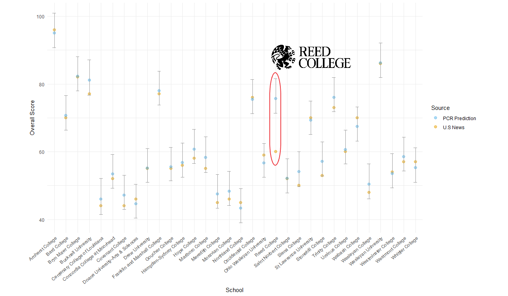

# A True Lie about Reed College: U.S News Ranking

The above graph is the result generated by a PCR model to predict Reed College's overall score used by U.S. News & Worlds Report (USNWR) in  their Best College Ranking. If I tell you the vertial bars are prediction intervals, would you be shocked by the result? I certainly was when I first got to this result. This graph is a sneak peek of an on-going course project of MATH343 Statistical Practicum at Reed College. Our group were tasked to help the Reed College's Office of Institutional Research investigate if Reed College is under-ranked by USNWR in their Best College Ranking because Reed College refuses to report statistics to USNWR. To put it in a nutshell, this research used Principal Component Regression and Elastic Net Regularized Regression methods to build predictive models, aiming to reproduce the USNWR College Rankings published in 2009 and 2019 and assess if non-reporting schools are truly under-ranked. The current result we have suggests that there is no systematic under-ranking for non-reporting schools. Reed College was shown to be the only institution that is significantly under-ranked by USNWR both in 2009 and 2019.
The following is a table representing the predicted overall score of Reed College, comparing with the overall score given by USNWR:
 

Source | 2009 Overall Score| 2019 Overall Score
-------|------|------
PCR    | 72   | 77
Elastic Net | 72 | 77
USNWR | 65 | 60

 
In 2009, instead of 54th, an overall score of 72 would place Reed College at the 37th rank among 124 liberal arts colleges and in 2019, instead of 90th, an overall score of 77 would place Reed College at the 36th rank among 173 liberal arts colleges.  

Unfortunately, due to confidentiality, I can't share the datasets on this repo. For more details on the project, **PLEASE READ THE DRAFT OF THE FINAL REPORT IN THE REPO** but please also keep in mind that the current draft is not at its final form yet. It will be updated regularly when revisions are made and there are some tables that needed to be add to the Appendix.
